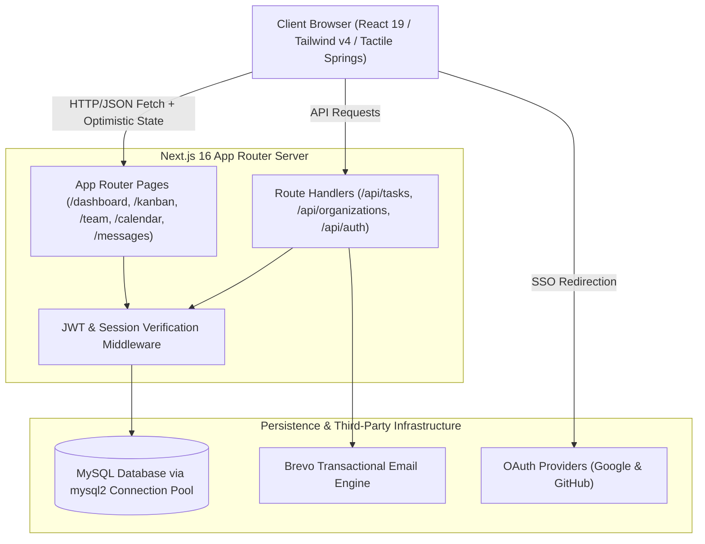
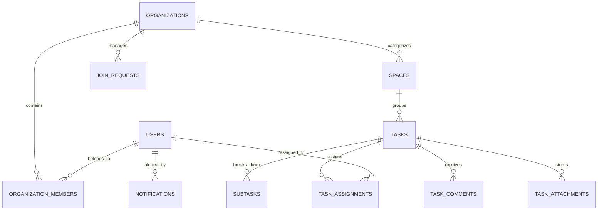
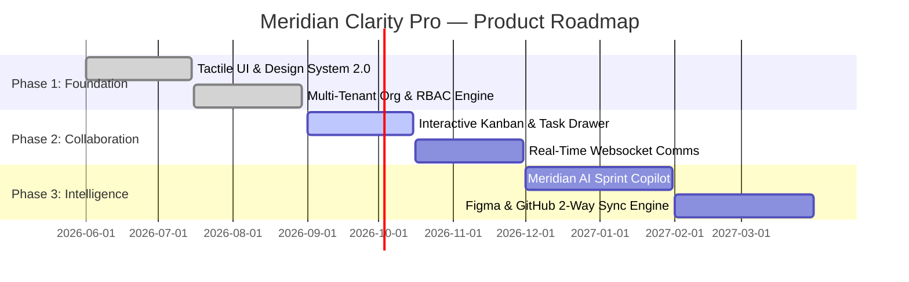

# Meridian Clarity Pro — Product Requirements Document (PRD)

**Product Name:** Meridian Clarity Pro  
**Document Version:** 2.4.0 (Enterprise Gold Release)  
**Status:** Approved & Living Document  
**Target Category:** Enterprise Workspace Orchestrator & Collaborative Sprint Operating System  
**Design Paradigm:** RonDesignLab High-Tactile Editorial SaaS / Award-Winning Craft  
**Repository:** `Meridian` (Next.js 16, React 19, Tailwind CSS v4, MySQL)  

---

## 1. Executive Summary & Product Vision

### 1.1 The $10M ARR Proposition
Modern enterprise product teams are drowning in fragmented, aesthetically bankrupt project management tools. Legacy platforms (Jira, Asana, Monday) suffer from feature bloat, visually fatiguing gray-on-white layouts, rigid hierarchies, and sluggish interactions that drain creative momentum.

**Meridian Clarity Pro** reimagines enterprise work orchestration as an award-winning luxury instrument. Built for hyper-growth technology companies, elite design studios, and product engineering teams who demand the polish of **Linear**, the physical tactile delight of **Teenage Engineering**, the editorial typography of **Kinfolk/Vogue**, and the architectural clarity of **RonDesignLab**.

```
       ┌────────────────────────────────────────────────────────┐
       │                 MERIDIAN CLARITY PRO                   │
       │     The Haute-Horlogerie of Project Orchestration      │
       └───────────────────────────┬────────────────────────────┘
                                   │
         ┌─────────────────────────┼─────────────────────────┐
         ▼                         ▼                         ▼
 ┌───────────────┐         ┌───────────────┐         ┌───────────────┐
 │ TACTILE SPEED │         │ VISUAL LUXURY │         │ DEEP TELEMETRY│
 │ Sub-50ms UX   │         │ Warm Bento    │         │ Watchmaker    │
 │ Kinetic Spring│         │ Editorial Ser.│         │ Precision     │
 │ Cmd+K Engine  │         │ Signature Hue │         │ Live Velocity │
 └───────────────┘         └───────────────┘         └───────────────┘
```

### 1.2 Core Product Tenets
1. **Tactility over Flatness:** Every toggle, card, segmented pill, and button possesses mechanical physical weight, kinetic spring damping, and haptic-like visual responsiveness.
2. **Editorial Gravitas meets Technical Precision:** High-contrast pairing of *Instrument Serif* italic highlights with *Urbanist* modern geometric structure and *Futura/JetBrains Mono* tabular metrics.
3. **Frictionless Velocity:** Sub-50ms local UI updates, optimistic task state propagation, keyboard-first navigation (`Cmd+K`), and instant drawer triage.
4. **Multi-Tenant Sovereign Spaces:** Seamless isolation and switching between client spaces, internal publications, and commercial product squads with enterprise RBAC.

---

## 2. Target Market & User Personas

### 2.1 Target Audience
* **High-Growth Startups & Scaleups:** Teams of 10–500 looking for an aspirational, unified operating system for sprint execution.
* **Top-Tier Design & Engineering Agencies:** Studios managing multi-million-dollar commercial client deliverables who require client-facing elegance and granular milestone tracking.
* **Product-Led Enterprises:** Organizations seeking to replace fractured tools (Jira + Trello + Slack + Notion) with a cohesive, beautifully curated ecosystem.

### 2.2 Key Personas

| Persona | Role | Primary Goal | Pain Point in Legacy Tools | Meridian Solution |
| :--- | :--- | :--- | :--- | :--- |
| **Elena Vance** | VP of Product / Head of Design | High-level sprint oversight, velocity monitoring, and stakeholder presentation | Clunky dashboard UIs that look like spreadsheets; poor visual hierarchy | Bento executive metrics, capacity dials, burn-up speedometers, and publication spaces |
| **Marcus Chen** | Principal Full-Stack Engineer | Fast task triage, minimal friction, rapid subtask completion, deep code/PR context | Laggy dropdown menus, sluggish ticket drawers, noisy notifications | Keyboard-first `Cmd+K`, sub-50ms task drawer, tactile drag-and-drop, clean subtask checklists |
| **Sophia Aris** | Design Lead & Art Director | Visual asset QA, deliverable mockups, cross-functional signoffs | Inability to preview high-fidelity mockups directly inside Kanban cards | Live card mockup thumbnails, interactive task drawers, tagged sprint lanes |
| **Julian Ward** | Managing Partner / Founder | Organization-wide billable capacity, multi-tenant workspace switching, team presence | Fragmented visibility into who is online and actively shipping | Real-time Kinetic Member Cards, online telemetry beacons, hours logged counters |

---

## 3. High-Level System Architecture

Meridian is architected as an ultra-responsive, hybrid server-rendered and client-hydrated web application leveraging Next.js 16 App Router, React 19 Concurrent Features, Tailwind CSS v4, and connection-pooled MySQL.



---

## 4. End-to-End Functional Specifications

### 4.1 Module: Multi-Tenant Organization & Access Control (RBAC)

#### Overview
Meridian operates on a strict multi-tenant workspace model. A single user account can belong to multiple organizations (e.g., "Acme Studio", "Apex Labs") with distinct roles and active contexts.

```
       [User Account]
             │
      ┌──────┴──────────────────────────┐
      ▼                                 ▼
[Organization Alpha]           [Organization Beta]
  • Role: Owner                  • Role: Member
  • Spaces: Commercial           • Spaces: Publications
  • Custom Invite Code           • Restricted Settings
```

#### Detailed Requirements
1. **Organization Switcher (`OrgSwitcher.jsx`):**
   - Floating tactile dropdown in the top header and sidebar.
   - Shows active organization name, slug, member badge, and active status.
   - One-click context switching with smooth background state refresh without full-page reloads.
   - Quick action triggers for "Create New Organization" and "Join via Code".
2. **Organization Creation (`CreateOrgModal.jsx`):**
   - Modal with input fields: Organization Name, Slug (auto-generated URL-safe), Description, Primary Color Accent.
   - Auto-generates an alphanumeric 8-character unique `invite_code`.
   - Automatically designates creator as `OWNER`.
3. **Organization Join Flow (`JoinOrgModal.jsx`):**
   - Direct Join: User enters valid 8-character `invite_code` to immediately join as `MEMBER`.
   - Request-Based Join: User requests to join private org; creates a `PENDING` join request.
   - Organization Leaders receive real-time badge counters in the `DynamicHeader` notification popover to `ACCEPT` or `REJECT` requests.
4. **Role Matrix:**
   - `OWNER`: Full administrative privilege, billing management, organization deletion, member expulsion, role editing.
   - `LEADER` / `ADMIN`: Task assignment, invitation generation, join request approval, space creation.
   - `MEMBER`: Task creation, subtask editing, comments, status updates, board reordering.
   - `GUEST`: Read-only access to assigned tasks and assigned project spaces.

---

### 4.2 Module: Dynamic Island & Navigation Command Deck

#### Overview
Floating at the zenith of the application, the `DynamicHeader` and `DynamicIsland` act as an interactive telemetry HUD and command center.

#### Detailed Requirements
1. **The Dynamic Island Capsule:**
   - Styled with dark obsidian pill geometry (`#111318`), border shine, and floating ambient shadow.
   - Displays real-time sprint countdown (e.g., `Sprint 24 • 04d 12h remaining`).
   - Integrated Live Session Indicator: Pulsing green beacon showing active team members in voice/sprint room.
   - Quick-action buttons: "New Task" (`+` hotkey), "Command Palette" (`⌘K`).
2. **Global Command Palette (`CommandPalette.jsx`):**
   - Triggered via `Cmd+K` (macOS) or `Ctrl+K` (Windows/Linux) or clicking the search capsule.
   - Fuzzy search indexing:
     * Navigation destinations (`/dashboard`, `/kanban`, `/team`, `/calendar`, `/analytics`, `/billing`, `/settings`).
     * Active tasks by ID (`MRD-001`) and keywords.
     * Team members by name and email.
     * Quick actions: "Create Task", "Invite Member", "Switch Org", "Toggle Dark/Light Mode".
   - Arrow-key navigation (`↑`, `↓`), Enter to execute, `Esc` to dismiss.
   - Translucent frosted glass backdrop (`backdrop-blur-md`).
3. **Notifications & Join Requests Popover:**
   - Bell icon with unread count badge.
   - Tabbed view: "All Notifications" and "Join Requests".
   - Inline "Approve" (Lime button) and "Decline" (Rose button) for pending member requests.

---

### 4.3 Module: Executive Bento Dashboard (`/dashboard`)

#### Overview
An asymmetric Bento-grid dashboard providing immediate, high-density situational awareness without visual clutter.

```
┌──────────────────────────────┬──────────────────────────────┬──────────────────────────────┐
│ BENTO KPI: Total Tasks       │ BENTO KPI: Efficiency Score  │ BENTO KPI: Sprint Completion │
│ 137 (+20% vs prev)           │ 8.6 / 10 (+0.5)              │ 74% (+10%)                   │
│ [Soft Lavender #EDE9FE]      │ [Soft Peach #FFEDD5]         │ [Soft Sky #E0F2FE]           │
├──────────────────────────────┴───────────────┬──────────────┴──────────────────────────────┤
│ ACTIVE LINEUP & SPEEDOMETER                  │ MY WORK EXECUTION QUEUE                     │
│ MRD-012 Financial Banking App (68%)          │ • Design 3 variations for card mockup [High]│
│ MRD-014 Design System Tokens (92%)           │ • Implement OAuth2 single sign-on [Crit]    │
│ Striped animated progress meters             │ Interactive subtask checklist toggles       │
├──────────────────────────────────────────────┴─────────────────────────────────────────────┤
│ HIGH-IMPACT METRIC CARDS (Tactile Day Sparklines & Capacity Dials)                         │
└────────────────────────────────────────────────────────────────────────────────────────────┘
```

#### Detailed Requirements
1. **Four Signature Pastel Bento KPI Widgets:**
   - **Total Tasks:** Pastel Lavender container (`#EDE9FE`), purple text (`#6D28D9`), inline SVG sparkline, delta pill.
   - **Efficiency Score:** Pastel Peach container (`#FFEDD5`), amber text (`#C2410C`), trend velocity meter.
   - **Sprint Completion:** Pastel Sky container (`#E0F2FE`), azure text (`#0369A1`), target accuracy radar.
   - **Team Velocity:** Pastel Lime container (`#ECFCCB`), lime text (`#3F6212`), rocket milestone indicator.
2. **Active Lineup Monitor:**
   - Displays critical deliverables in flight with custom striped progress bars (`striped-bar-orange`, `striped-bar-purple`).
   - Shows active time spent, assignee avatars, category badges (`Commercial`, `Publications`), and percentage completion.
3. **"My Work" Execution Queue:**
   - Tabbed filtering: `To Do`, `In Progress`, `Completed`.
   - Direct interactive subtask checkboxes: users can check subtasks directly from the dashboard card without opening modals.
   - Real-time progress bar recalculation upon subtask toggle.
4. **MetricCard Component (`MetricCard.jsx`):**
   - 7-day interactive bar graph (Mon–Sun) with hover tooltips and dynamic highlight states.
   - Tactile pill header displaying trend percentage with tabular numerals.
   - Theme variations: `purple`, `amber`, `sky`, `lime`, `rose`.

---

### 4.4 Module: Interactive Tactile Kanban Board (`/kanban`)

#### Overview
The centerpiece of Meridian's daily operations. A fluid, high-frame-rate kanban system designed with tactile feedback, subtask progress indicators, and mockup card displays.

#### Detailed Requirements
1. **Column Architecture:**
   - Standard Swimlanes: `To do`, `In Progress`, `In Review`, `Done`.
   - Customizable swimlanes per organization space.
   - Column header features: Count pill with monospace tabular counter, quick `+` add task button, column menu dropdown.
2. **Card Mechanics & Tactile Physics:**
   - **Drag & Drop:** Smooth pointer tracking, 1-degree card tilt (`rotate(1deg)`), subtle scale reduction (`scale(0.97)`), and deep ambient shadow on drag.
   - **Drop Zones:** Dashed border container highlighting (`drag-over-column`) with smooth layout reflow.
3. **Card Anatomy:**
   - Monospace Ticket ID: `MRD-001`, `MRD-002` in subtle mono badge.
   - Title: Styled in high-contrast sans typography.
   - Mockup Preview: Embedded aspect-ratio container showcasing UI designs, Dribbble shots, or architectural diagrams.
   - Inline Subtask Mini-Bar: Visual fractional bar (e.g., `2/4 done`) with completion percentage.
   - Tag Pills: Soft pastel capsules (e.g., `Design`, `Commercial`, `Dev`).
   - Priority Badge: `Low` (Gray), `Medium` (Sky), `High` (Orange), `Critical` (Rose with glowing dot).
   - Multi-Assignee Avatar Stack: Overlapping rounded circles with initials and user presence halos.
4. **Quick Triage & Filtering:**
   - Filter by Space, Priority, Assignee, and Tag.
   - Tactile Segmented Control (`TactileSegmentedControl.jsx`) for switching between `Board`, `List`, `Timeline`, and `Analytics` views.

---

### 4.5 Module: Task Detail Drawer & Execution Canvas (`TaskDetailDrawer.jsx`)

#### Overview
A slide-over drawer sliding from the right screen boundary with friction-damped spring animation, allowing deep task inspection without losing board context.

#### Detailed Requirements
1. **Header & Fast State Triage:**
   - Direct status pill selector (`To do`, `In progress`, `In review`, `Done`).
   - Priority segmented selector with instant database synchronization.
   - Close button (`Esc` shortcut listener) and Share link copy trigger.
2. **Content Sections:**
   - **Title & Description:** Inline editable title and rich markdown description area.
   - **Subtask Checklist Engine:**
     * Add new subtask with inline Enter key commit.
     * Checkbox toggling with strikethrough transition and audio-haptic feedback visual cue.
     * Drag handle to reorder subtask priority.
     * Dynamic progress meter at the top of the checklist.
   - **Assignee & Metadata Sidebar:**
     * Assignee selection with live user list.
     * Due Date picker with relative date indicators ("Today", "In 2 days", "Overdue").
     * Time Tracking logger: Start/Stop timer with live elapsed counter.
   - **Activity & Discussion Stream:**
     * Chronological comment list with user avatars, timestamps, and edit capabilities.
     * Markdown-supported comment input box with `@mention` tagging.
     * System activity entries: "Elena moved task from In Progress to In Review", "Marcus checked off subtask #2".

---

### 4.6 Module: Temporal Scheduling & Sprint Calendar (`/calendar`)

#### Overview
Combines traditional calendar scheduling with sprint milestones and synchronous meeting rooms.

#### Detailed Requirements
1. **Views:** Month grid, 7-Day Sprint Horizon, and Daily Schedule.
2. **Task & Milestone Plotting:**
   - Tasks with assigned due dates automatically populate on the calendar canvas.
   - Color-coded by Space or Priority.
   - Drag-to-reschedule: Dragging a task block from Tuesday to Thursday immediately updates `due_date` via optimistic API call.
3. **Live Meeting & Sprint Standup HUD:**
   - Integrates scheduled sprint syncs with direct launch link (Google Meet / Zoom / Meridian Audio Room).
   - "Join Standup" one-click button directly from the Dynamic Island.

---

### 4.7 Module: Team Directory & Kinetic Member Cards (`/team`)

#### Overview
Real-time presence tracking, capacity management, and team directory presented in kinetic, interactive card structures.

#### Detailed Requirements
1. **Kinetic Member Card (`KineticMemberCard.jsx`):**
   - High-contrast card with subtle hover lift and radial gradient glow.
   - User Avatar with status beacon:
     * `Online` (Bright Lime `#84cc16` with infinite gentle pulse animation).
     * `In Sprint / Busy` (Amber `#f59e0b`).
     * `Offline` (Muted Zinc `#a1a1aa`).
   - Live Role Badge: `Owner`, `Lead Product Designer`, `Senior Frontend Architect`.
   - Workload Gauge: Active assigned task count and project count.
   - Time Logged Telemetry: Real-time logged hours for the current weekly cycle.
   - Quick Action: "Send Message" button routing directly into `/messages` with pre-filled conversation.
2. **Invite Member Modal (`InviteModal.jsx`):**
   - Direct email invitation dispatch via Brevo transactional email engine.
   - One-click copyable unique organization invite link (`https://meridian.app/join?code=XYZ123`).
   - Role designation selector for new invites (`Leader`, `Member`, `Guest`).

---

### 4.8 Module: Project Spaces & Unified Comms (`/messages`)

#### Overview
Dedicated project channels and direct messaging bridging the gap between sprint execution and asynchronous team communication.

#### Detailed Requirements
1. **Spaces Architecture:**
   - `Publications`: Marketing deliverables, Dribbble shots, case studies.
   - `Commercial`: Client portals, enterprise contracts, billing milestones.
   - `Design Internal`: Design System 2.0, token updates, brand assets.
2. **Chat Mechanics:**
   - Threaded discussions linked directly to specific Task IDs (`#MRD-012`).
   - Rich text formatting: code snippets, blockquotes, attachments, image mockups.
   - Optimistic message rendering with pending delivery indicator and delivery confirmation checkmarks.

---

### 4.9 Module: Billing, Quotas & Enterprise Subscriptions (`/billing`)

#### Overview
Self-serve subscription management, seat allocation, and feature tier enforcement.

#### Tier Specifications

| Feature | Starter ($0/mo) | Pro ($24/user/mo) | Enterprise ($48/user/mo) |
| :--- | :--- | :--- | :--- |
| **Max Members** | Up to 5 members | Up to 50 members | Unlimited |
| **Active Projects / Spaces** | 3 Spaces | Unlimited Spaces | Unlimited Spaces + Custom Domains |
| **File Storage** | 2 GB total | 100 GB total | 1 TB + Dedicated AWS S3 Bucket |
| **Telemetry & Analytics** | 7-day lookback | 90-day lookback | Unlimited lookback + CSV/BI Export |
| **Support SLA** | Community | 12-hour Priority | 1-hour Dedicated Slack Channel |
| **Security & Compliance** | Standard SSO | Google & GitHub OAuth | SAML / Okta / Azure AD + Audit Logs |

---

## 5. Data Architecture & Relational Schema

The underlying database utilizes MySQL with normalized relations, foreign key constraints, and indexed lookups for sub-millisecond query execution.



### 5.1 Relational Schema Definitions (DDL)

```sql
-- 1. Users Table
CREATE TABLE users (
  id INT AUTO_INCREMENT PRIMARY KEY,
  first_name VARCHAR(100) NOT NULL,
  last_name VARCHAR(100) NOT NULL,
  email VARCHAR(255) NOT NULL UNIQUE,
  password_hash VARCHAR(255) NULL, -- Nullable for OAuth users
  auth_provider ENUM('local', 'google', 'github') DEFAULT 'local',
  avatar_url VARCHAR(500) NULL,
  created_at TIMESTAMP DEFAULT CURRENT_TIMESTAMP,
  updated_at TIMESTAMP DEFAULT CURRENT_TIMESTAMP ON UPDATE CURRENT_TIMESTAMP,
  INDEX idx_user_email (email)
) ENGINE=InnoDB DEFAULT CHARSET=utf8mb4 COLLATE=utf8mb4_unicode_ci;

-- 2. Organizations Table
CREATE TABLE organizations (
  id INT AUTO_INCREMENT PRIMARY KEY,
  name VARCHAR(150) NOT NULL,
  slug VARCHAR(150) NOT NULL UNIQUE,
  description TEXT NULL,
  invite_code VARCHAR(32) NOT NULL UNIQUE,
  logo_url VARCHAR(500) NULL,
  created_by INT NOT NULL,
  created_at TIMESTAMP DEFAULT CURRENT_TIMESTAMP,
  FOREIGN KEY (created_by) REFERENCES users(id) ON DELETE CASCADE,
  INDEX idx_org_slug (slug),
  INDEX idx_org_invite_code (invite_code)
) ENGINE=InnoDB DEFAULT CHARSET=utf8mb4 COLLATE=utf8mb4_unicode_ci;

-- 3. Organization Memberships (RBAC)
CREATE TABLE organization_members (
  id INT AUTO_INCREMENT PRIMARY KEY,
  organization_id INT NOT NULL,
  user_id INT NOT NULL,
  role ENUM('OWNER', 'LEADER', 'MEMBER', 'GUEST') DEFAULT 'MEMBER',
  joined_at TIMESTAMP DEFAULT CURRENT_TIMESTAMP,
  UNIQUE KEY uq_org_user (organization_id, user_id),
  FOREIGN KEY (organization_id) REFERENCES organizations(id) ON DELETE CASCADE,
  FOREIGN KEY (user_id) REFERENCES users(id) ON DELETE CASCADE
) ENGINE=InnoDB DEFAULT CHARSET=utf8mb4 COLLATE=utf8mb4_unicode_ci;

-- 4. Join Requests
CREATE TABLE join_requests (
  id INT AUTO_INCREMENT PRIMARY KEY,
  organization_id INT NOT NULL,
  user_id INT NOT NULL,
  status ENUM('PENDING', 'ACCEPTED', 'REJECTED') DEFAULT 'PENDING',
  created_at TIMESTAMP DEFAULT CURRENT_TIMESTAMP,
  FOREIGN KEY (organization_id) REFERENCES organizations(id) ON DELETE CASCADE,
  FOREIGN KEY (user_id) REFERENCES users(id) ON DELETE CASCADE
) ENGINE=InnoDB DEFAULT CHARSET=utf8mb4 COLLATE=utf8mb4_unicode_ci;

-- 5. Project Spaces
CREATE TABLE spaces (
  id INT AUTO_INCREMENT PRIMARY KEY,
  organization_id INT NOT NULL,
  name VARCHAR(100) NOT NULL,
  slug VARCHAR(100) NOT NULL,
  color_accent VARCHAR(30) DEFAULT '#8b5cf6',
  created_at TIMESTAMP DEFAULT CURRENT_TIMESTAMP,
  FOREIGN KEY (organization_id) REFERENCES organizations(id) ON DELETE CASCADE
) ENGINE=InnoDB DEFAULT CHARSET=utf8mb4 COLLATE=utf8mb4_unicode_ci;

-- 6. Tasks Table
CREATE TABLE tasks (
  id INT AUTO_INCREMENT PRIMARY KEY,
  task_code VARCHAR(50) NOT NULL, -- e.g., 'MRD-001'
  organization_id INT NOT NULL,
  space_id INT NULL,
  title VARCHAR(255) NOT NULL,
  description TEXT NULL,
  status ENUM('todo', 'in_progress', 'in_review', 'done') DEFAULT 'todo',
  priority ENUM('Low', 'Medium', 'High', 'Critical') DEFAULT 'Medium',
  due_date DATE NULL,
  has_mockup BOOLEAN DEFAULT FALSE,
  mockup_url VARCHAR(500) NULL,
  created_by INT NOT NULL,
  created_at TIMESTAMP DEFAULT CURRENT_TIMESTAMP,
  updated_at TIMESTAMP DEFAULT CURRENT_TIMESTAMP ON UPDATE CURRENT_TIMESTAMP,
  FOREIGN KEY (organization_id) REFERENCES organizations(id) ON DELETE CASCADE,
  FOREIGN KEY (space_id) REFERENCES spaces(id) ON DELETE SET NULL,
  FOREIGN KEY (created_by) REFERENCES users(id) ON DELETE CASCADE,
  INDEX idx_task_status (status),
  INDEX idx_task_org (organization_id)
) ENGINE=InnoDB DEFAULT CHARSET=utf8mb4 COLLATE=utf8mb4_unicode_ci;

-- 7. Subtasks
CREATE TABLE subtasks (
  id INT AUTO_INCREMENT PRIMARY KEY,
  task_id INT NOT NULL,
  title VARCHAR(255) NOT NULL,
  is_completed BOOLEAN DEFAULT FALSE,
  position INT DEFAULT 0,
  created_at TIMESTAMP DEFAULT CURRENT_TIMESTAMP,
  FOREIGN KEY (task_id) REFERENCES tasks(id) ON DELETE CASCADE
) ENGINE=InnoDB DEFAULT CHARSET=utf8mb4 COLLATE=utf8mb4_unicode_ci;

-- 8. Task Assignees
CREATE TABLE task_assignees (
  task_id INT NOT NULL,
  user_id INT NOT NULL,
  PRIMARY KEY (task_id, user_id),
  FOREIGN KEY (task_id) REFERENCES tasks(id) ON DELETE CASCADE,
  FOREIGN KEY (user_id) REFERENCES users(id) ON DELETE CASCADE
) ENGINE=InnoDB DEFAULT CHARSET=utf8mb4 COLLATE=utf8mb4_unicode_ci;

-- 9. Task Comments
CREATE TABLE task_comments (
  id INT AUTO_INCREMENT PRIMARY KEY,
  task_id INT NOT NULL,
  user_id INT NOT NULL,
  content TEXT NOT NULL,
  created_at TIMESTAMP DEFAULT CURRENT_TIMESTAMP,
  FOREIGN KEY (task_id) REFERENCES tasks(id) ON DELETE CASCADE,
  FOREIGN KEY (user_id) REFERENCES users(id) ON DELETE CASCADE
) ENGINE=InnoDB DEFAULT CHARSET=utf8mb4 COLLATE=utf8mb4_unicode_ci;

-- 10. Notifications
CREATE TABLE notifications (
  id INT AUTO_INCREMENT PRIMARY KEY,
  user_id INT NOT NULL,
  organization_id INT NULL,
  type VARCHAR(50) NOT NULL,
  title VARCHAR(255) NOT NULL,
  body TEXT NULL,
  is_read BOOLEAN DEFAULT FALSE,
  created_at TIMESTAMP DEFAULT CURRENT_TIMESTAMP,
  FOREIGN KEY (user_id) REFERENCES users(id) ON DELETE CASCADE
) ENGINE=InnoDB DEFAULT CHARSET=utf8mb4 COLLATE=utf8mb4_unicode_ci;
```

---

## 6. Comprehensive API Endpoint Catalog

All endpoints adhere to RESTful standards, authenticated via Bearer JWT tokens stored in HTTP-Only secure cookies.

### 6.1 Authentication & User API
* `POST /api/auth/signup` — Registers new account, generates JWT cookie, initial welcome trigger.
* `POST /api/auth/login` — Authenticates email/password, issues JWT session.
* `POST /api/auth/oauth/google` — Google OAuth credential exchange.
* `POST /api/auth/oauth/github` — GitHub OAuth token verification.
* `GET /api/auth/me` — Fetches active user session, organization memberships, and profile metadata.
* `POST /api/auth/logout` — Destroys session cookie.

### 6.2 Organization API
* `GET /api/organizations` — Returns all organizations the authenticated user belongs to.
* `POST /api/organizations/create` — Creates new organization, assigns creator as `OWNER`, creates default spaces.
* `POST /api/organizations/join` — Joins an organization using an 8-character invite code.
* `GET /api/organizations/member` — Lists active members of the current active organization.
* `POST /api/organizations/member/invite` — Sends email invitation via Brevo with secure onboarding token.
* `POST /api/organizations/join-request/accept` — Approves pending member join request.
* `POST /api/organizations/join-request/reject` — Declines pending member join request.

### 6.3 Tasks & Sprint Execution API
* `GET /api/tasks?organizationId={id}&spaceId={id}` — Retrieves organization task tree with subtasks, assignees, and comments.
* `POST /api/tasks/add_task` — Creates a new task with title, priority, status, due date, and assignees.
* `PATCH /api/tasks/[id]` — Updates task status (e.g., drag-and-drop column change), priority, or title.
* `DELETE /api/tasks/[id]` — Soft-deletes or archives task.
* `POST /api/tasks/[id]/subtasks` — Adds a new subtask to the specified task.
* `PATCH /api/subtasks/[id]` — Toggles subtask completion state (`is_completed`).
* `POST /api/tasks/[id]/comments` — Posts a comment on a task thread.

### 6.4 Telemetry & Notifications API
* `GET /api/notification` — Retrieves user notifications and pending organization join requests.
* `POST /api/notification/mark-read` — Marks notification items as read.
* `GET /api/analytics/velocity` — Aggregates burndown, velocity score, and weekly hours distribution.

---

## 7. Non-Functional Requirements (NFRs)

### 7.1 Performance Benchmarks
* **Largest Contentful Paint (LCP):** < 1.1s on 4G connections.
* **Interaction to Next Paint (INP):** < 45ms for all tactile components (segmented controls, drag lifts, drawer triggers).
* **Time to Interactive (TTI):** < 1.4s.
* **API Response P95:** < 75ms for database queries; connection pool warm reuse.
* **Frame Rate:** Locked 60fps (and 120fps on ProMotion displays) for all CSS transforms and spring animations.

### 7.2 Security & Compliance
* **Password Encryption:** Bcrypt hashing with cost factor of 12.
* **Transport Security:** Strict HTTPS / HSTS enabled; secure HTTP-Only, SameSite=Lax JWT cookies.
* **SQL Injection Prevention:** 100% parameterized queries via `mysql2/promise`.
* **Input Sanitization:** Strict schema validation on all API input parameters.
* **Audit Logging:** System logs for critical administrative operations (membership modifications, organization role changes).

### 7.3 Accessibility (a11y)
* Full compliance with **WCAG 2.1 Level AA**.
* Accessible color contrast ratios: minimum 4.5:1 for standard text; 3:1 for large display text and tabular numerals.
* Complete keyboard operability (`Tab`, `Shift+Tab`, `ArrowKeys`, `Enter`, `Space`, `Escape`).
* ARIA attributes across all dynamic components (`aria-expanded`, `aria-selected`, `aria-modal`, `role="tablist"`).

---

## 8. Success Metrics & Key Performance Indicators (KPIs)

1. **Daily Active User (DAU) Velocity:** Average actions per user session > 24 interactions (high engagement with subtasks, board moves, and command palette).
2. **Task Turnaround Speed:** Time from creation in `To do` to completion in `Done` reduced by 35% compared to legacy PM tools.
3. **Session Friction Rate:** Sub-0.05% error rate on drag-and-drop reorders and status toggles.
4. **Viral Expansion Coefficient (K-Factor):** > 1.25 driven by seamless 1-click invite codes and cross-organization switching.

---

## 9. Product Roadmap



* **Phase 1 (Delivered):** Core Next.js 16 architecture, RonDesignLab typography & pastel tokens, MySQL schema, OAuth2 & JWT session management.
* **Phase 2 (Current Focus):** Real-time optimistic Kanban sync, Dynamic Island HUD enhancements, interactive subtask drag reordering.
* **Phase 3 (Next Horizon):** Meridian AI Copilot for automated sprint burndown summaries, Figma mockup bidirectional sync, and native macOS desktop shell (Tauri).
